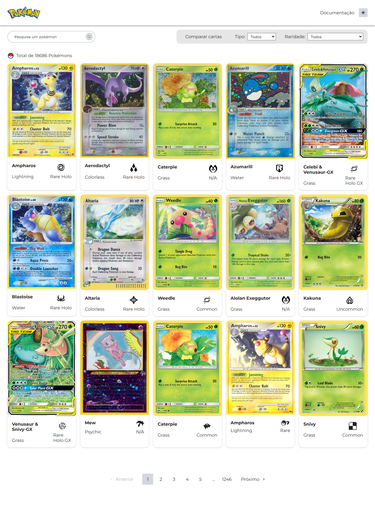
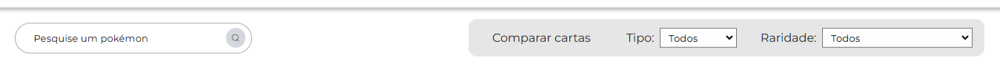
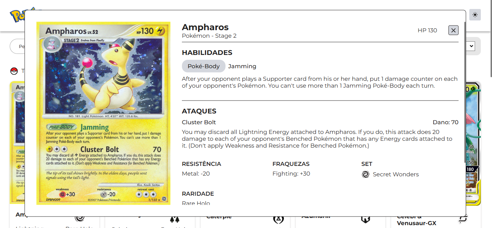
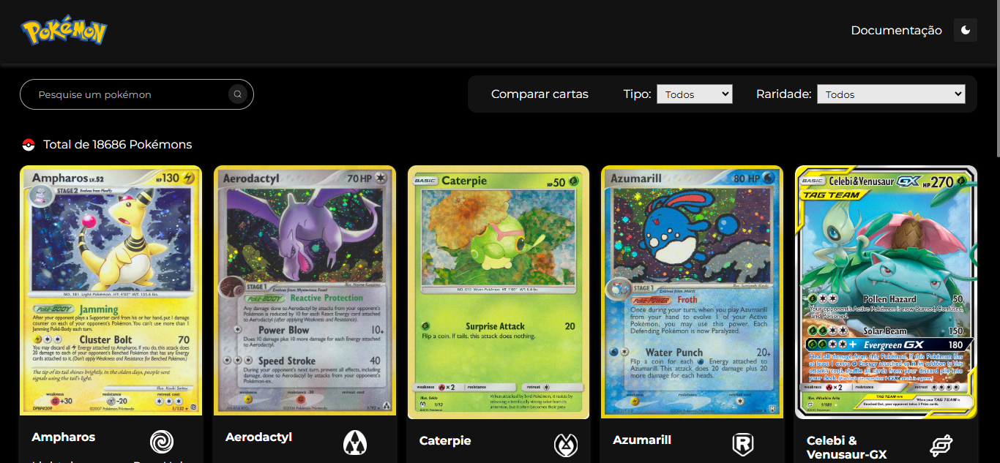
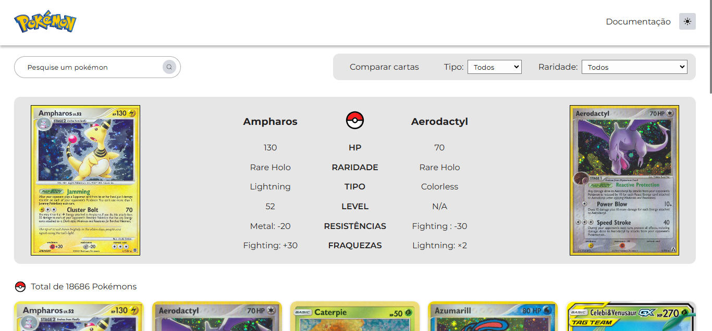

O Projeto foi feito com React.tsx consumindo a api do [PokemonTCG](https://docs.pokemontcg.io/api-reference/cards/search-cards/) 



## Funcionalidades

### Filtro de busca
Permite busca por nome, raridade e tipo


### Janela modal
Contendo informações detalhadas sobre as cartas


### Botão para alterar entre os temas escuro e claro.
A preferência é salva no localStorage


### Sistema para comparação de cartas
Sistema que permite que o usuário compare atributos de duas cartas


### Navegação entre páginas
Permite que o usuário navegue pelas páginas, tendo assim acesso a todas as cartas. (São mostradas 15 cartas por página)


## Iniciando Projeto
Para instalar as dependencias necessárias navegue até a pasta do projeto e digite o comando no terminal
 
```bash
 npm install
```

Para execultar o projeto você precisará de uma chave de acesso da Api. Você pode obte-la ao se cadastrar no site: [PokemonTCG.io](https://dev.pokemontcg.io/). Após ter sua chave crie um arquivo ".env" na raiz do projeto como descrito abaixo

```bash
 VITE_API_KEY="SUA_CHAVE"
```

Para execultar o projeto use o comando abaixo

```bash
 npm run dev
```


